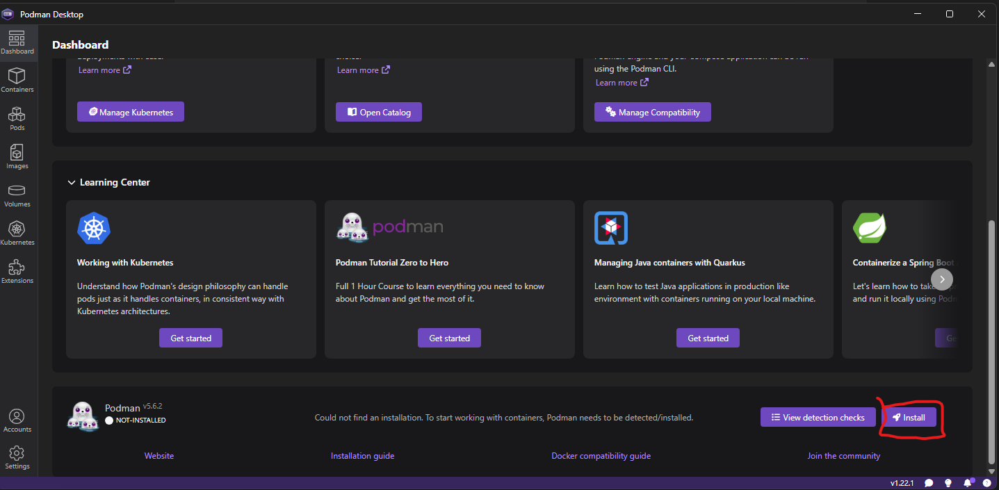
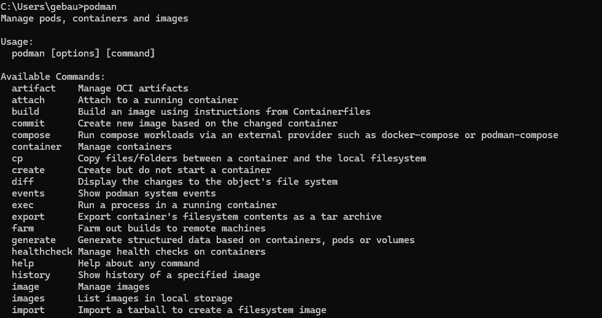
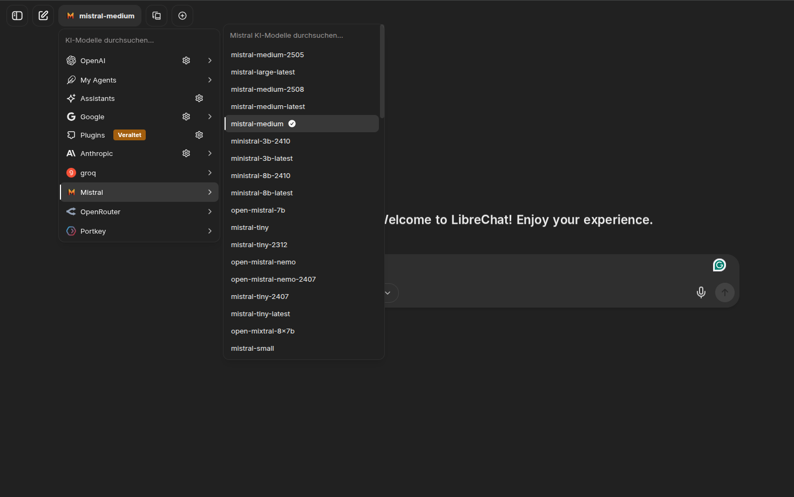
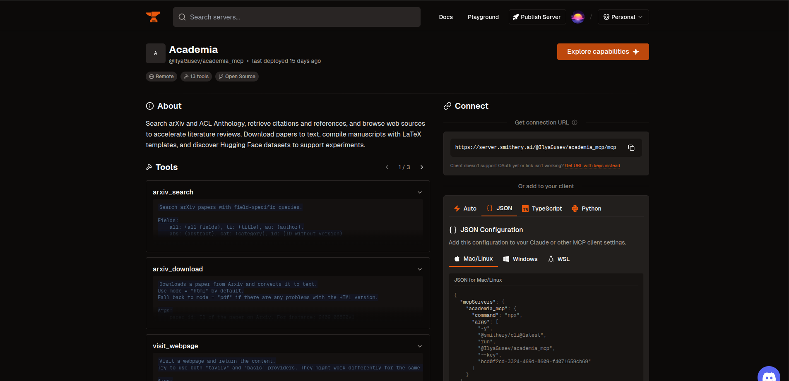
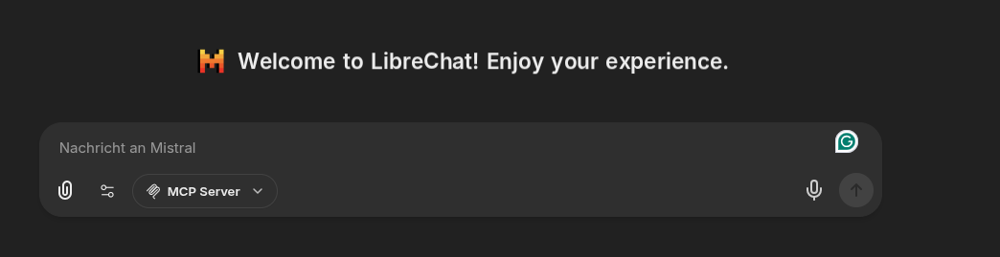
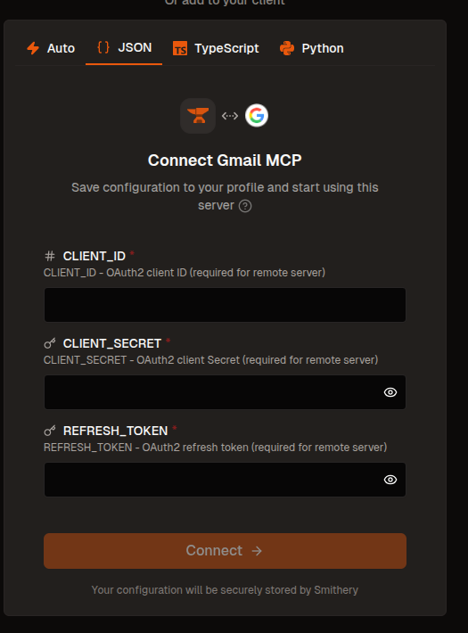

# LibreChat Test Repository

This is a demo repository for LibreChat, designed to help you learn and experiment with its Agent functionalities and configuration.

## Repository Structure

This repository is organized as follows:

* **Root directory**: Contains configuration files (`librechat.yaml`, `docker-compose.override.yml`) that are under version control. Edit these files here.
* **LibreChat subdirectory**: A git submodule pointing to the official LibreChat repository. Don't update the submodule! This is where you run LibreChat.

**Workflow**: Configuration files in the root directory are mounted into the LibreChat container via `docker-compose.override.yml`. When you edit `librechat.yaml` in the root and copy it into the LibreChat folder, the changes are automatically available to LibreChat when you restart the containers.

## Prerequisites

**Note**: This tutorial is primarily designed for Windows using Podman. However, the same principles apply to Docker on any platform (Linux, macOS, Windows). Simply replace `podman` with `docker` in all commands.

## Clone the Repository

Create a [GitHub](https://github.com/) account and get familiar with [cloning a repository](https://docs.github.com/en/repositories/creating-and-managing-repositories/cloning-a-repository).
Make sure to clone the repository with a [generated SSH-Key](https://docs.github.com/de/authentication/connecting-to-github-with-ssh/generating-a-new-ssh-key-and-adding-it-to-the-ssh-agent) and [add it to your github Account](https://docs.github.com/de/authentication/connecting-to-github-with-ssh/adding-a-new-ssh-key-to-your-github-account).

## Podman Desktop + Podman + WSL

1. Download the [Installer for Windows](https://podman-desktop.io/downloads) and start the installation process.
2. Open Podman Desktop. From there, you can install Podman by navigating to the Dashboard and following the setup instructions.
3. If you don't have Windows Subsystem for Linux (WSL), the installation will prompt you to install it. Please do so.



**Verify the installation:**

1. Press `Windows Key + R` to open the Run dialog
2. Type `cmd` and press Enter to open the command prompt
3. Type `podman` in the terminal

You should see the Podman help output as shown below:



Congratulations, you've installed Podman!

**Troubleshooting resources:**

* [Podman for Windows Tutorial](https://github.com/containers/podman/blob/main/docs/tutorials/podman-for-windows.md)
* [Podman Desktop Troubleshooting Guide](https://gist.github.com/brainfoolong/117a0f7562cb2c51b824db4011d40d29)

## Podman Compose

You also need to install Podman Compose. Please refer to this [tutorial](https://podman-desktop.io/docs/compose/setting-up-compose).

## Text Editor and Command Line

It is recommended to use a text editor or IDE. A good solution is [VSCode](https://code.visualstudio.com/Download). With VSCode, you can edit files and run command line operations. If you're not familiar with VSCode, check out the [VSCode Getting Started guide](https://code.visualstudio.com/docs/getstarted/getting-started).

You can also use any other tool. Just ensure two things:

* You can edit files
* You can access the command line and run Podman/Docker commands

Hence, [Notepad++](https://notepad-plus-plus.org/downloads/) combined with [CMD](https://kostnix-web.de/tipps-tricks/eingabeaufforderung-cmd-als-administrator-oeffnen/) or [PowerShell](https://learn.microsoft.com/de-de/powershell/scripting/windows-powershell/starting-windows-powershell?view=powershell-7.5) are also sufficient.

## Getting Started Tutorial

This tutorial will teach you the basic functionalities of LibreChat and how to configure AI agents with MCP (Model Context Protocol) servers. Make sure to go through each section in order. Have fun!

## 1. Running LibreChat

1. **Clone the repository** with this command:

   ```bash
   git clone git@github.com:gebauerm/librechat_test.git --recurse-submodules
   ```

   This will also load the LibreChat repository as a [submodule](https://git-scm.com/book/en/v2/Git-Tools-Submodules) into `./LibreChat`. Configuration files are managed in the parent repository.

2. **Change into the LibreChat folder** and create the following directories:

   ```bash
   cd LibreChat
   mkdir -p Meili_data_v1.12 data-node images uploads logs
   ```

3. **Create an `.env` file** from `.env.example` and uncomment lines 68 and 69:

   ```bash
   cp .env.example .env
   ```

   Then edit the `.env` file and set:

   ```bash
   UID=1000
   GID=1000
   ```

4. **Start LibreChat** by typing:

   ```bash
   podman compose up
   ```

   (If using Docker instead of Podman, use `docker compose up`)

   Docker/Podman Compose will start several containers. Docker Compose is a lightweight orchestration tool for containers. LibreChat is a collection of multiple containers communicating with each other. You can check all running LibreChat containers by typing:

   ```bash
   podman ps
   ```

   Do you see what components need to be started to run LibreChat?

**Troubleshooting:**

If you have issues with the configuration and run into errors, you can restart the LibreChat container faster with:

```bash
podman restart LibreChat
```

For example, if you comment out the `UID` value again and restart the LibreChat container, you may encounter an error.
If this doesnt help to fix a problem restart LibreChat completely by pressing `STRG + c` in the command line. Afterwards use `docker compose up` again.

**Accessing LibreChat:**

When LibreChat is running, access it at [http://localhost:3080](http://localhost:3080/login). You will be prompted with a login page. Create a new user and log in. The email and username don't have to be real.

## 2. Add an LLM Provider to LibreChat

In this section, you'll configure LibreChat to use Mistral AI as an LLM provider.

1. **Configure the API key:**

   We will provide you with a Mistral API key. Add this key to your `.env` file in the `LibreChat` directory:

   ```bash
   MISTRAL_API_KEY=<your-key-here>
   ```

2. **Configuration files are already set up!**

   The `librechat.yaml` and `docker-compose.override.yml` files in the root directory already contain the necessary Mistral configuration. These files are automatically mounted into the LibreChat container.

3. **Restart the containers:**

   ```bash
   podman compose restart
   ```

4. **Select a Mistral model:**

   Open LibreChat in your browser and select a Mistral model from the dropdown in the top left.

   

For more details, refer to the [official documentation](https://www.librechat.ai/docs/configuration/librechat_yaml/ai_endpoints/mistral).

## 3. arXiv Agent

In this section, you'll connect an arXiv MCP (Model Context Protocol) server to LibreChat. With this MCP server, you'll be able to download and search academic papers on arXiv.

**What is MCP?** Model Context Protocol (MCP) is a standard that allows AI agents to connect to external tools and data sources. In this case, we're connecting to arXiv's academic paper database.

We'll use [Smithery](https://smithery.ai/) to find a suitable MCP server. When connecting to Smithery, you'll need to link it to your GitHub account. Please read carefully which data is shared with Smithery.

[Smithery](https://smithery.ai/) provides many MCP servers that can be integrated directly with LibreChat. We'll use [Academia](https://smithery.ai/server/@IlyaGusev/academia_mcp) from Smithery, which offers seamless integration with LibreChat.

**Steps:**

1. **Get the MCP server configuration:**

   Go to the JSON section of [Academia](https://smithery.ai/server/@IlyaGusev/academia_mcp). You'll need the configuration details shown there.

   

2. **Add the configuration to `librechat.yaml`:**

   Open the `librechat.yaml` file in the root directory and add the following configuration under the `mcpServers` section. Be mindful of the YAML structure and indentation:

   ```yaml
   mcpServers:
     academia_mcp:
       command: npx
       args:
         - "-y"
         - "@smithery/cli@latest"
         - "run"
         - "@IlyaGusev/academia_mcp"
         - "--key"
         - "<smithery-key>"
   ```

   The key you need is provided in the JSON format on Smithery. Paste in the correct key. If you compare carefully, you'll see that this configuration matches the JSON format shown on the [Academia](https://smithery.ai/server/@IlyaGusev/academia_mcp) page.

3. **Restart LibreChat:**

   ```bash
   podman restart LibreChat
   ```

   Alternatively, press `Ctrl+C` to stop the containers and then run `podman compose up` again.

4. **Test the arXiv agent:**

   * Open LibreChat and navigate to the MCP Server section:

     

   * Click on "MCP Server" and choose "academia_mcp".

5. **Try it out:**

   Search for the paper "Attention is all you need" and ask the agent to download it. A link should appear directing you to the PDF.

**For credentials, ask the repository owner.**

## 4. Gmail Agent

In this section, you'll add a [Gmail MCP server](https://smithery.ai/server/@shinzo-labs/gmail-mcp) that allows LibreChat to compose and draft emails on your behalf.

**Steps:**

1. **Add Client Confoguration:**
    Smithery will prompt you to add details to the following configuration:

    .

    To achieve this please refer to the documentation of smithery.

    To configure Client Secret and Client ID this please refer to the documentation of smithery.

    For this configuration you will be provided with a testaccount, together with client credentials. The test account is a google account that you can freely use. Ask the repo owner for details or refer to the presentation.

    **Alternative**

    If you are struggeling use this configuration:

        academia_mcp:
        command: npx
        args:
            - "-y"
            - "@smithery/cli@latest"
            - "run"
            - "@shinzo-labs/gmail-mcp"
            - "--key"
            - "<smithery-key>"
            - "--profile"
            - "<profile-gmail>"

    The credentials can be found in the provided mail account. For questions regarding credentials ask the Track Guide or refer to the presentation.

3. **Test the Gmail agent:**

   Ask LibreChat to write an email about "Siamese Cats being the best financial advisors" to an email address of your choice. If you got issues with the Agent not starting, try to be more explicit to the generative Model. If a process starts and finishes, navigate to the provided Gmail account and check the drafts folder. You should see a drafted email that you can review and send.

## 5. Explore More MCP Servers

Now you're set to experiment! You can add more MCP servers using the same JSON configuration approach. You can also use the provided google account to experiment. If you need more google account APIs activated contact the repo owner.

**Resources:**

* Browse available MCP servers on [Smithery](https://smithery.ai/)
* Follow the same pattern: get the JSON configuration, add it to `librechat.yaml`, restart LibreChat, and test it out

The possibilities are endless—explore different tools and integrations to enhance your LibreChat experience!
